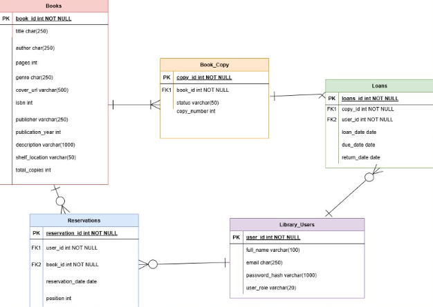

# Library Management System

A full-stack web application for managing library inventory, user accounts, and book lending. The system allows libraries to track books, manage loans and reservations, and enables users to browse and borrow books through an intuitive web interface.

This project demonstrates a complete client–server architecture using a modern TypeScript stack.

# Features

- Role-Based Authentication: Separate permissions for administrators and users

- Book Inventory Management: Add, update, and remove books from the catalog

- Loan Tracking: Track active loans and due dates

- Reservation System: Users can reserve books that are currently unavailable

- Book Browsing: Search and browse the library catalog

- Persistent Database Storage: All data stored in PostgreSQL with normalized schemas

# Tech Stack

## Frontend

- React

- TypeScript

- Vite

## Backend

- Node.js

- Express

## Database

- PostgreSQL

## Development Tools

- Git / GitHub

- VSCode

## Project Management

- Jira
- Slack

## System Architecture

The frontend communicates with the backend using RESTful API routes, which handle authentication, book management, and loan/reservation operations.

## Database Design

The system uses a normalized relational schema to model books, users, loans, and reservations.

Key design choices include:

- Separating Books and Book_Copy to track individual physical copies.

- Supporting reservation queues with a position field.

= Linking Loans to specific book copies rather than titles.

### ER Diagram

# Installation

1️.) Clone the repository
git clone https://github.com/yourusername/library-management-system.git
cd library-management-system

2️.) Install frontend dependencies
cd client
npm install

3️.) Install backend dependencies
cd ../server
npm install

4.) Set up environment variables
Create a .env file in the server directory:

DATABASE_URL=your_postgres_connection_string
JWT_SECRET=your_secret_key

5️.) Start the development servers

Frontend: npm run dev

Backend: npm run start

# Future Improvements

Planned enhancements for the system include:

*Admin Reporting Tools*: Provide dashboards and reports for administrators, such as most borrowed books, overdue loan statistics, and inventory summaries

*Personalized Book Recommendations*: Suggest books to users based on borrowing history, genre preferences, and popular titles

*User Review System*: Allow users to rate books, leave written reviews, and browse community feedback

*Support for Additional Media Types*: Expand the system to support materials beyond books, such as DVDs, audiobooks, magazines, and digital media
